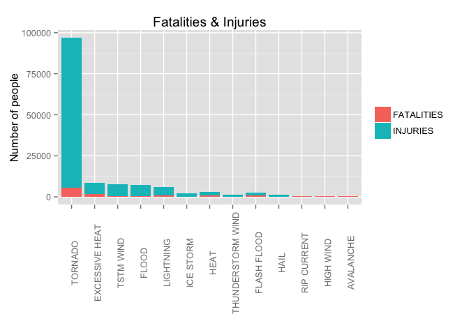

# Heavy Weather: What Hurts & What Costs? (Reproducable Research Peer Assignment 2)
Jason Murray  
January 25, 2015  

# Introduction

Storms and other severe weather events can cause both public health and economic problems for communities and municipalities. Many severe events can result in fatalities, injuries, and property damage, and preventing such outcomes to the extent possible is a key concern.

This project involves exploring the U.S. National Oceanic and Atmospheric Administration's (NOAA) storm database. This database tracks characteristics of major storms and weather events in the United States, including when and where they occur, as well as estimates of any fatalities, injuries, and property damage.

This project was project was conducted as Peer Assignment 2 for the Reproducible Research course, January 2015 session. 

# Data Processing

The platform used for analysis is:

* Mac OS 10.10 (Yosemite)
* RStudio 0.98.977
* Output from sessionInfo() follows below


```r
library (plyr)
library (ggplot2)
library (knitr)
library (rmarkdown)
sessionInfo()
```

```
## R version 3.1.0 (2014-04-10)
## Platform: x86_64-apple-darwin13.1.0 (64-bit)
## 
## locale:
## [1] en_CA.UTF-8/en_CA.UTF-8/en_CA.UTF-8/C/en_CA.UTF-8/en_CA.UTF-8
## 
## attached base packages:
## [1] stats     graphics  grDevices utils     datasets  methods   base     
## 
## other attached packages:
## [1] rmarkdown_0.4.2 knitr_1.8       ggplot2_1.0.0   plyr_1.8.1     
## 
## loaded via a namespace (and not attached):
##  [1] colorspace_1.2-4 digest_0.6.4     evaluate_0.5.5   formatR_1.0     
##  [5] grid_3.1.0       gtable_0.1.2     htmltools_0.2.4  MASS_7.3-33     
##  [9] munsell_0.4.2    proto_0.3-10     Rcpp_0.11.2      reshape2_1.4    
## [13] scales_0.2.4     stringr_0.6.2    tools_3.1.0      yaml_2.1.13
```

The data for this comes from the NOAA NCDC in a bzipped csv format. 
You can obtain the the data [here](https://d396qusza40orc.cloudfront.net/repdata%2Fdata%2FStormData.csv.bz2).

The columns we are interested in are:

* EVTYPE: the event type
* FATALITIES: deaths directly as a result of the weather event
* INJURIES: injuries directly as a result of the weather event
* PROPDMG: estimate of property damage caused by the weather event
* PROPDMGEXP: K (thousands), M (millions) or B (billions)
* CROPDMG: estaimte of crop damage caused by the weather event
* CROPDMGEXP: K (thousands), M (millions) or B (billions)


```r
# fetch the data and load it into a data frame
# only download if it doens't exist in the working directory
# if you want to refresh you data delete the .bz2 file and it will fetch a fresh copy
weatherURL <- "https://d396qusza40orc.cloudfront.net/repdata%2Fdata%2FStormData.csv.bz2"
filename <- "repdata-data-StormData.csv.bz2"
if (!file.exists(filename)) {
   download.file (weatherURL, "repdata-data-StormData.csv.bz2", method='curl')
}
storms <- read.csv(bzfile(filename))

# first combine the *DMG and *DMGEXP into a proper dollar value we can work with
storms$PDEXP <- 1
storms$DPEXP[storms$PROPDMGEXP=="" | storms$PROPDMGEXP=="+" | storms$PROPDMGEXP=="?" | storms$PROPDMGEXP=="-"] <- 1
storms$PDEXP[storms$PROPDMGEXP=='H' | storms$PROPDMGEXP=='h'] <- 100
storms$PDEXP[storms$PROPDMGEXP=='K' | storms$PROPDMGEXP=='k'] <- 1000
storms$PDEXP[storms$PROPDMGEXP=='M' | storms$PROPDMGEXP=='m'] <- 1000000
storms$PDEXP[storms$PROPDMGEXP=='B' | storms$PROPDMGEXP=='h'] <- 1000000000
storms$PROPDMGREAL <- storms$PROPDMG * storms$PDEXP

storms$CPEXP <- 1
storms$CPEXP[storms$CROPDMGEXP=="" | storms$CROPDMGEXP=="+" | storms$CROPDMGEXP=="?" | storms$CROPDMGEXP=="-"] <- 1
storms$CPEXP[storms$CROPDMGEXP=='H' | storms$CROPDMGEXP=='h'] <- 100
storms$CPEXP[storms$CROPDMGEXP=='K' | storms$CROPDMGEXP=='k'] <- 1000
storms$CPEXP[storms$CROPDMGEXP=='M' | storms$CROPDMGEXP=='m'] <- 1000000
storms$CPEXP[storms$CROPDMGEXP=='B' | storms$CROPDMGEXP=='h'] <- 1000000000
storms$CROPDMGREAL <- storms$CROPDMG * storms$CPEXP
```

Sum up and aggregate the data into one data frame. We can do this all in one go with ddply. Afterwards we will do some manipulation so that graphing becomes easier. 


```r
# sum up the varios impacts
impact <- ddply(storms, .(EVTYPE), summarize,
                      deaths = sum(FATALITIES, na.rm=TRUE),
                      injuries = sum(INJURIES, na.rm=TRUE),
                      propdmg = sum(PROPDMGREAL),
                      cropdmg = sum(CROPDMGREAL)
                )
impact$health <- impact$deaths + impact$injuries
impact$damage <- impact$propdmg + impact$cropdmg

# manipulate data for health impacts to make it easier to graph
deathImpact <- impact[order(impact$deaths, decreasing=TRUE),][1:10,][,1:2]
deathImpact$TYPE <- "FATALITIES"
names(deathImpact)[2] <- "PEOPLE"
injuryImpact <- impact[order(impact$injuries, decreasing=TRUE),][1:10,][,c(1,3)]
injuryImpact$TYPE <- "INJURIES"
names(injuryImpact)[2] <- "PEOPLE"
healthImpact <- transform (rbind(deathImpact, injuryImpact), EVTYPE=reorder(EVTYPE, -PEOPLE))

# do the same for economic losses
propdmgImpact <- impact[order(impact$propdmg, decreasing=TRUE),][1:10,][,c(1,4)]
propdmgImpact$TYPE <- "PROPERTY"
names(propdmgImpact)[2] <- "DAMAGE"
cropdmgImpact <- impact[order(impact$cropdmg, decreasing=TRUE),][1:10,][,c(1,5)]
cropdmgImpact$TYPE <- "CROP"
names(cropdmgImpact)[2] <- "DAMAGE"
econImpact <- transform (rbind(propdmgImpact, cropdmgImpact), EVTYPE=reorder(EVTYPE, -DAMAGE))
econImpact$DAMAGE <- econImpact$DAMAGE / 1000000
```

# Results

When we look at a stacked bar graph of the top 10 most impactful event types according to fatalities and injuries we get the following chart. Clearly tornados are by far the most impactful of weather events, whether in terms of fatalities or injuries.


```r
qplot(
  EVTYPE, 
  PEOPLE, 
  data = healthImpact,
  fill = TYPE,
  geom = "bar",
  stat = "identity",
  main = "Fatalities & Injuries",
  ylab = "Number of people",
  xlab = ""
) + scale_fill_discrete("") + theme(axis.text.x = element_text(angle = 90))
```

 

When we look at a stacked bar graph of the economic impact of the 10 most impactful event types according to cost impact to property and crops we get the following chart. Clearly floods are the most impactful event. Hurricanes/typhoons, and storm surges also have a significant impact. Tornado also have a significant impact. All other forces forms of weather have an impact that is at least an order of magenitude less than these four.


```r
qplot(
  EVTYPE, 
  DAMAGE, 
  data = econImpact,
  fill = TYPE,
  geom = "bar",
  stat = "identity",
  main = "Economic damage",
  ylab = "Damage in millions $USD",
  xlab = ""
) + scale_fill_discrete("") + theme(axis.text.x = element_text(angle = 90))
```

 

# Conclusion

The four most impactful types of weather events are tornado, floods, hurricanes, and storm surges. Any policy and spending towards reducing impact to health or the economy should focus on these four types of events. 
